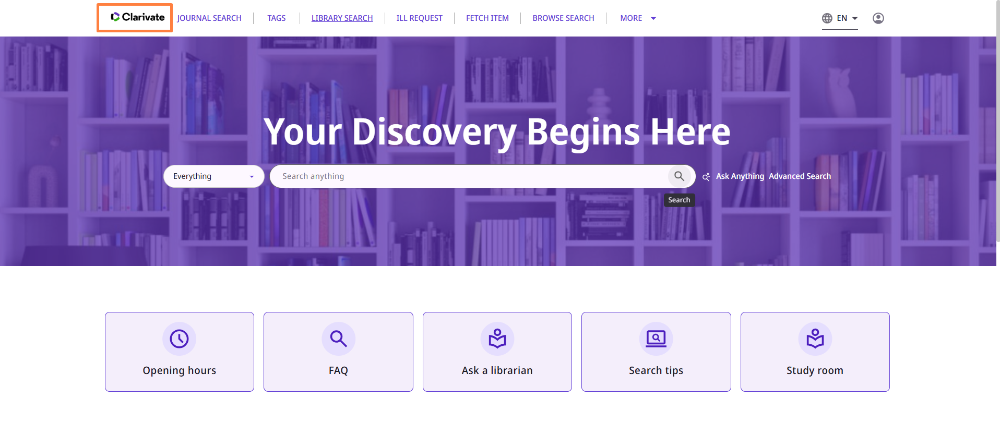
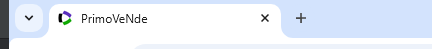
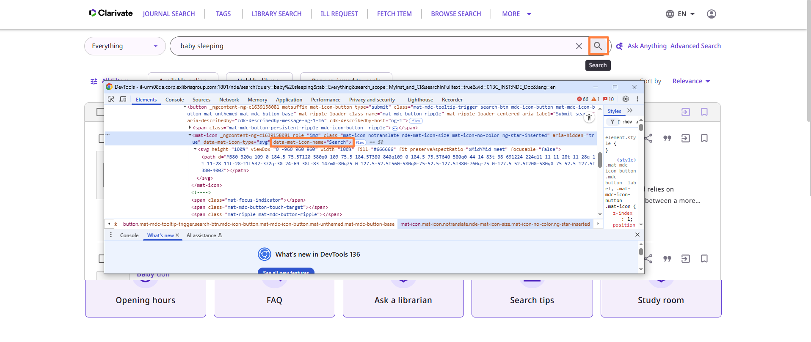
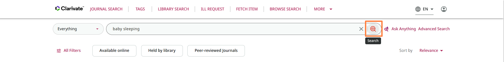
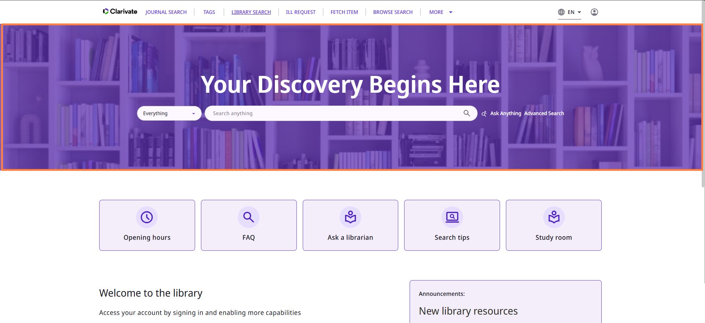
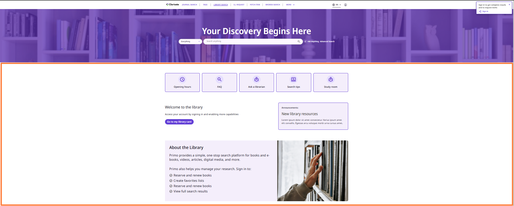

# Primo NDE Customization

All of the NDE customization is done via the `assets` folder, located at the base of the customization folder named after the `vid` you are customizing.  
Inside the `assets` folder, the files are divided into the following subfolders:

- **js**
- **css**
- **images**
- **icons**
- **homepage**
- **header-footer**

In the following sections, you’ll find details on which files can be placed in each folder to customize different parts of the NDE UI.  
You can also refer to [Understanding the File Structure of a Customization Package](https://knowledge.exlibrisgroup.com/Primo/Product_Documentation/020Primo_VE/Primo_VE_(English)/030Primo_VE_User_Interface/010NDE_UI_Customization_-_Best_Practices#Using_the_Customization_Package_Manager).

---

## js

### `custom.js`
Use this file to run any JavaScript code when loading the NDE UI.

---

## css

### `custom.css`
Use this file to modify the styling of the NDE UI.

---

## images

### `library-logo.png`
Use this file to set the logo that appears at the top of the app.  

### `icon_<resource_type>.png`
Set the default resource type thumbnail by placing files following this naming convention:  
`icon_<resource_type>.png`

        For Example:
        `icon_book.png`

## icons

### favicon.ico
use this file to set the favicon that will appear in the browser tab

### custom_icons.svg
Use this file to override the default svg icons used in the NDE UI.

You can find the id of the icon you would like to override by inspecting the element in the browser and looking at the data-mat-icon-name attribute of the mat-icon element containing the svg icon you would like to override.

For example:

Our id here is 'Search' (the id is case sensitive)
Inside the custom_icons.svg file you will add a new symbol element with the id 'Search' and the svg code you would like to use as the icon. 
This needs to be placed inside the enclosing svg element. You can add many such symbols to the file with different id.

In our example the contents of the custom_icons.svg file might look like this:

`<?xml version="1.0" encoding="UTF-8"?>
<svg xmlns="http://www.w3.org/2000/svg" xmlns:xlink="http://www.w3.org/1999/xlink" width="0" height="0">
  <symbol id="Search" height="24px" viewBox="0 -960 960 960" width="24px" fill="">
    <path d="M440-240q116 0 198-81.5T720-520q0-116-82-198t-198-82q-117 0-198.5 82T160-520q0 117 81.5 198.5T440-240Zm0-280Zm0 160q-83 0-147.5-44.5T200-520q28-70 92.5-115T440-680q82 0 146.5 45T680-520q-29 71-93.5 115.5T440-360Zm0-60q55 0 101-26.5t72-73.5q-26-46-72-73t-101-27q-56 0-102 27t-72 73q26 47 72 73.5T440-420Zm0-40q25 0 42.5-17t17.5-43q0-25-17.5-42.5T440-580q-26 0-43 17.5T380-520q0 26 17 43t43 17Zm0 300q-75 0-140.5-28.5t-114-77q-48.5-48.5-77-114T80-520q0-74 28.5-139.5t77-114.5q48.5-49 114-77.5T440-880q74 0 139.5 28.5T694-774q49 49 77.5 114.5T800-520q0 64-21 121t-58 104l159 159-57 56-159-158q-47 37-104 57.5T440-160Z"/>
  </symbol>
</svg>
`

and the result will be:

## homepage

### homepage_background.svg
Use this file to set the background image of the homepage

### homepage_<language_code>.html
Use this file to set the html content of the homepage for a specific language.

The language code should be the code of the language you are customizing for. 
For example for English use `homepage_en.html` for French use `homepage_fr.html` etc. 
If no file is set for some language code it will use English file by default.

### homepage.css
Use this file to set the styling for the homepage html content (homepage_<language_code>.html) with CSS

## header-footer
Add header or footer files in the following file conventions header_<language_code>.html and footer_<language_code>.html
For example to add footer for English use `footer_en.html` for French use `foooter_fr.html` etc. 